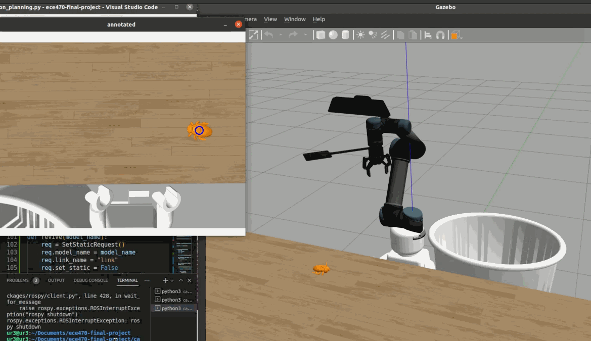

Team members: Christopher Xu, Vanessa Blas, Ethan Hsiao

Languages: ROS scripts that control the robot are written in Python 3. Drivers are imported in C++.

Our robot arm will first identify moving cockroaches, terminate the roaches, then dispose of the roaches in a trash bin set in a known position. The arm will start holding a flyswatter. It will use a webcam to detect moving cockroaches and rotate the swatter down to hit each of them quickly. After all of the roaches are hit, the arm will pick up each dead roach then drop it in the trash. 

The motivation for this project is to find a modern solution to our century old problem. We need something that can kill cockroaches without human assistance so humans can spend time on more important tasks. Some possible challenges that the team may encounter include how to implement the addition of the flyswatter and the change from flyswatter to pick-up. Another challenge includes how to implement movement of the block to represent the movement of cockroaches. Features to implement in the future would be possibly having different sized blocks to represent different sized pests, or have a certain goal of killing rate/surface area. The reasoning behind using Gazebo is that it best represents a simulation of real physics through the pick and place task. Gazebo allows us to simulate the exact same code on the virtual UR3 arm, so we have the convenience of transfering code meant for the real arm directly to simulation. In the future, we can easily use the same code for simulation on the real robot. The next step for the project is to actually build up the backbone codes needed to simulate a cockroach roaming through the workspace and let the camera capture its position. We’re very proud of the fact that we can make changes in the codes and visualize those changes in real-time simulations. We learned in this project that solving problems in simulations can save a lot of time and resources. As long as we get on track of building the environment, it’ll be more than easy for us to test out any situation within minutes.


Run the following in the catkin_ws directory:
```
source devel/setup.bash
```
Launch the world
```
roslaunch levelManager lego_world.launch
```
Spawn a roach in the world:
```
rosrun levelManager levelManager.py roach
```
Start the kinematics process
```
rosrun motion_planning motion_planning.py
```
Start the localization process
```
rosrun vision lego_vision.py -show
```
- `-show` : show the results of the recognition and localization process with an image

Delete a roach from the world:
```
rosrun levelManager levelManager.py unroach
```
